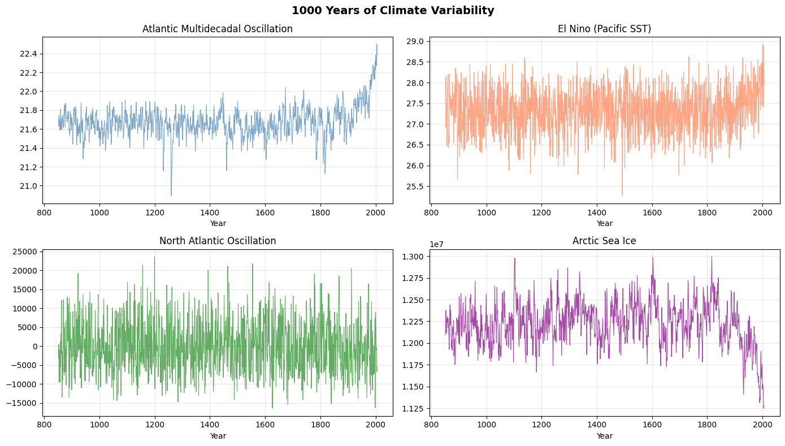
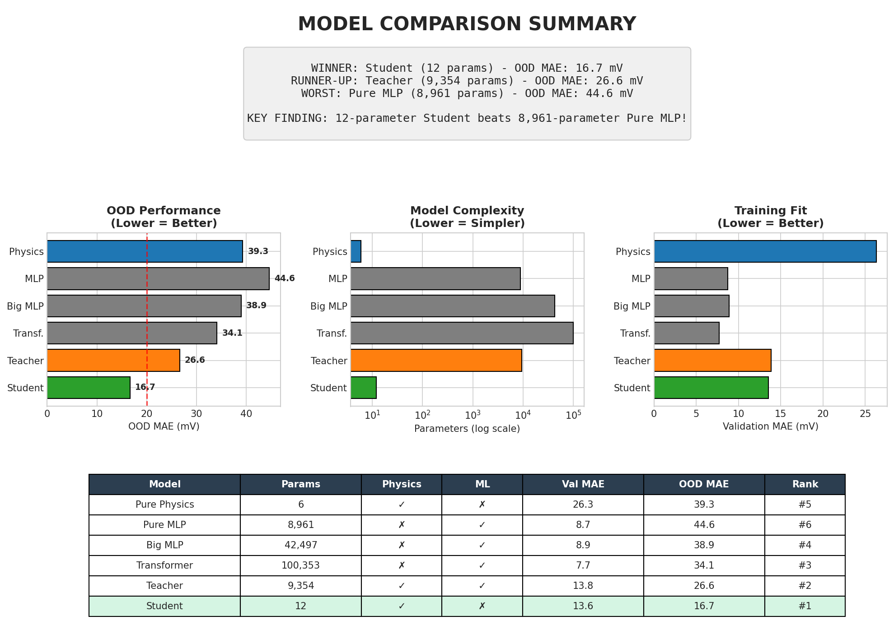
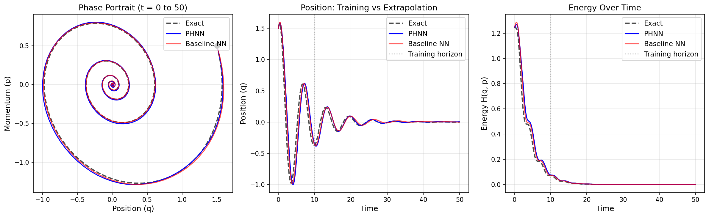
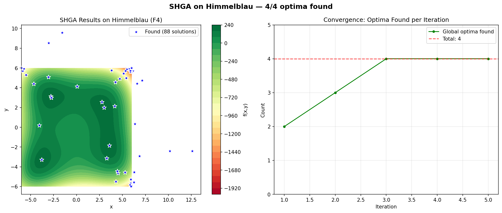
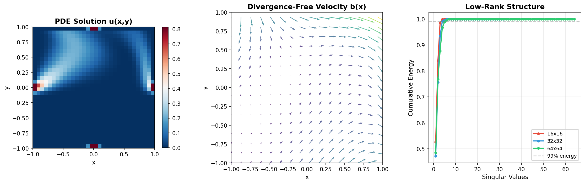

# NAIC-deliverable-report-D7.10

* Document title: Summary of completed demonstrators D7.10
* Creation date: 2026-03-12
* Document ID: ##DOCUMENTID##
* Document owner: hasv
* Recorder-Email: hasv@norceresearch.no
* Document recorder name: Hasan Asyari Arief
* Document URI(with version tracking) : ##DOCUMENTID_URL##
* Template ID: REPORT
* Project: DOCUMENTATION

* Deliverable ID: D7.10
* Contributor(s): Klaus Johannsen, Odd Helge Otterå, Adrian Evensen, Hasan Asyari Arief, Xue-Cheng Tai, Gro Fonnes, Saruar Alam, Sølve Eidnes, Kjetil Olsen Lye, Nadine Goris, Bjørnar Jensen, Jerry Tjiputra, Yngve Heggelund
* Work-package(s): WP7
* Tasks included:
   * D7.2 Use Case 1 — Climate Indices Teleconnection
   * D7.3 Use Case 2 — PEM Electrolyzer PINN Optimizer
   * D7.4 Use Case 3 — Pseudo-Hamiltonian Neural Networks
   * D7.5 Use Case 4 — 3D Medical Image Registration & Segmentation
   * D7.6 Use Case 5 — Graph-Based Classification of AIS Time-Series Data
   * D7.7 Use Case 6 — Multi-Modal Optimization
   * D7.8 Use Case 7 — Latent Representation of PDE Solutions

* Completion Date: 2026-03-13
* Time Spent:
* Approval:
   * Status:
      * [x] Pending
      * [ ] Approved
      * [ ] Rejected
   * Approved by: [Name/Title]
* Dissemination level
   * [ ] Private/Invited only
   * [ ] Work package
   * [ ] NAIC Project
   * [ ] Partners
   * [x] Public

---

**Building the foundation for Norway's AI sovereignty with Compute and Competence**
*Funded by the Norwegian research council (grant number: 322336)*

---
## Revision history

  - [V1/2026-03-13/Hasan Asyari Arief/Initial report combining all WP7 demonstrators]

---
## Glossary of Terms

| Term | Description |
| :--- | :--- |
| **AIS** | Automatic Identification System — a maritime tracking system used on ships for broadcasting vessel position, speed, course, and identity information. |
| **AMV** | Atlantic Multidecadal Variability — a pattern of sea surface temperature variability in the North Atlantic spanning multiple decades. |
| **ANTsPy** | Advanced Normalization Tools for Python — a medical image registration and segmentation library. |
| **CEC2013** | IEEE Congress on Evolutionary Computation 2013 — a standardized benchmark suite for multimodal optimization with 20 test functions. |
| **CMA-ES** | Covariance Matrix Adaptation Evolution Strategy — a derivative-free optimization algorithm for continuous domains. |
| **DGL** | Deep Graph Library — a Python library for building and training graph neural networks. |
| **Digital Twin** | A real-time virtual replica of a physical system, combining physics-based models with live telemetry for monitoring and optimization. |
| **GNN** | Graph Neural Network — a class of neural networks designed to operate on graph-structured data. |
| **HD-BET** | High-Definition Brain Extraction Tool — an AI-based tool for accurate brain extraction from MRI scans. |
| **Knowledge Distillation** | A model compression technique where a small "student" model learns to mimic a larger "teacher" model. |
| **LBM** | Lattice Boltzmann Method — a computational fluid dynamics approach used for simulating fluid flow. |
| **NAIC** | Norwegian AI Cloud — a national infrastructure project providing accessible AI/ML computing resources across Norwegian research institutions. |
| **NAIC Orchestrator** | A cloud VM provisioning platform at orchestrator.naic.no for deploying GPU-enabled virtual machines for AI workloads. |
| **NorESM** | Norwegian Earth System Model — a global climate model used for long-term climate simulations. |
| **OOD** | Out-of-Distribution — data that differs from the training distribution, used to evaluate model generalization. |
| **PDE** | Partial Differential Equation — a mathematical equation involving partial derivatives, fundamental to physics and engineering simulations. |
| **PEM** | Proton Exchange Membrane — a type of electrolyzer technology used for green hydrogen production via water electrolysis. |
| **PHNN** | Pseudo-Hamiltonian Neural Network — a physics-informed neural network architecture that decomposes system dynamics into conservation, dissipation, and external force components. |
| **PINN** | Physics-Informed Neural Network — a neural network architecture that incorporates physical laws (e.g., governing equations) as constraints during training. |
| **SHGA** | Scalable Hybrid Genetic Algorithm — an optimization algorithm combining Deterministic Crowding GA with CMA-ES for multimodal optimization. |

---

## 1. Executive Summary

The Norwegian AI Cloud promised that shared infrastructure could lower the barrier for researchers to apply machine learning in their own domains. Work Package 7 tested that promise by building seven demonstrator projects, each solving a real research problem and each packaged as a self-contained pipeline that runs on NAIC Orchestrator VMs.

The seven use cases cover a wide range of AI techniques and scientific disciplines. Some, like the PEM electrolyzer optimizer (UC2) and pseudo-Hamiltonian networks (UC3), explore how embedding physics into neural networks can produce models that are smaller and generalize better than pure data-driven approaches. Others, like the climate teleconnection analysis (UC1) and AIS vessel classification (UC5), tackle large-scale data-driven discovery, finding patterns that would be impractical to identify manually. The rest address foundational computational challenges: multi-modal optimization (UC6), latent PDE representations (UC7), and medical image registration (UC4).

They all share a common workflow: each demonstrator ships a Jupyter notebook that a researcher can provision on an NAIC Orchestrator VM and run end-to-end, from data loading through training to results, without managing infrastructure. This report summarizes the scientific contribution, methodology, and current status of each demonstrator.

| Use Case | Title | Repository | DOI | Status |
| :--- | :--- | :--- | :--- | :--- |
| **UC1** | Climate Indices Teleconnection | [wp7-UC1-climate-indices-teleconnection](https://github.com/NAICNO/wp7-UC1-climate-indices-teleconnection) | [10.5281/zenodo.19184215](https://doi.org/10.5281/zenodo.19184215) | **Completed** |
| **UC2** | PEM Electrolyzer PINN Optimizer | [wp7-UC2-pem-electrolyzer-digital-twin](https://github.com/NAICNO/wp7-UC2-pem-electrolyzer-digital-twin) | [10.5281/zenodo.19184217](https://doi.org/10.5281/zenodo.19184217) | **Completed** |
| **UC3** | Pseudo-Hamiltonian Neural Networks | [wp7-UC3-pseudo-hamiltonian-neural-networks](https://github.com/NAICNO/wp7-UC3-pseudo-hamiltonian-neural-networks) | [10.5281/zenodo.19184219](https://doi.org/10.5281/zenodo.19184219) | **Completed** |
| **UC4** | 3D Medical Image Registration & Segmentation | [wp7-UC4-medical-image-registration](https://github.com/NAICNO/wp7-UC4-medical-image-registration) | [10.5281/zenodo.19184221](https://doi.org/10.5281/zenodo.19184221) | **Completed** |
| **UC5** | Graph-Based Classification of AIS Data | [wp7-UC5-ais-classification-gnn](https://github.com/NAICNO/wp7-UC5-ais-classification-gnn) | [10.5281/zenodo.19184225](https://doi.org/10.5281/zenodo.19184225) | **Completed** |
| **UC6** | Multi-Modal Optimization | [wp7-UC6-multimodal-optimization](https://github.com/NAICNO/wp7-UC6-multimodal-optimization) | [10.5281/zenodo.19184224](https://doi.org/10.5281/zenodo.19184224) | **Completed** |
| **UC7** | Latent Representation of PDE Solutions | [wp7-UC7-latent-pde-representation](https://github.com/NAICNO/wp7-UC7-latent-pde-representation) | [10.5281/zenodo.19184227](https://doi.org/10.5281/zenodo.19184227) | **Completed** |

---

## 2. Detailed Progress by Activity

### 2.1 UC1 — Climate Indices Teleconnection Analysis

**Repository:** [wp7-UC1-climate-indices-teleconnection](https://github.com/NAICNO/wp7-UC1-climate-indices-teleconnection)
**Contributors:** Klaus Johannsen, Odd Helge Otterå, Adrian Evensen, Hasan Asyari Arief (NORCE Research)
**Tutorial:** [https://naicno.github.io/wp7-UC1-climate-indices-teleconnection/](https://naicno.github.io/wp7-UC1-climate-indices-teleconnection/)

#### The Problem

Climate teleconnections are large-scale patterns that link distant regions' weather and climate. They are central to decadal climate prediction, but identifying them from observational data is hard. Traditional approaches rely on expert-curated index pairs and linear statistics. UC1 tests whether machine learning can systematically discover teleconnection relationships across a large set of climate indices, including non-linear ones, and use them for multi-decadal forecasts.

#### Approach

The team worked with three long-term climate simulations from the Norwegian Earth System Model (NorESM1-F), spanning 850–2005 AD under different forcing scenarios (low solar, high solar, and a 1000-year pre-industrial control). These simulations provide 65 climate indices covering surface temperatures, sea surface temperatures, sea ice concentration, precipitation, atmospheric pressure, and ocean circulation.

The ML pipeline normalizes all indices to a 0–100 scale, generates lagged features to capture temporal dependencies (up to 150-year lags), and trains an ensemble of five model types, from linear regression baselines through Random Forest and XGBoost to MLP neural networks. Feature importance is averaged across ensemble runs, top-N features are selected, and performance is evaluated using Pearson correlation and MAE. An optional Morlet wavelet bandpass filter isolates specific frequency bands for targeted analysis.

*Figure 1: Overview of climate indices used in UC1, spanning surface temperatures, sea ice, precipitation, atmospheric pressure, and ocean circulation from NorESM simulations.*

#### What It Found

Over 42,613 individual experiments were conducted across all model–target–lag combinations. ML models achieved correlation coefficients exceeding 0.7 for more than 20 target climate indices, identifying statistically significant teleconnections across multi-decadal timescales. These results support 10–50 year forecasts of patterns such as Atlantic Multidecadal Variability (AMV) and Pacific Decadal Variability (PDV).

#### Infrastructure

UC1 runs on the NAIC Orchestrator for interactive exploration via `demonstrator-v1.orchestrator.ipynb`. It also provides a full CLI for automated parameter sweeps, which makes it a useful reference for how large-scale ML experiments can use NAIC infrastructure.

---

### 2.2 UC2 — PEM Electrolyzer PINN Optimizer

**Repository:** [wp7-UC2-pem-electrolyzer-digital-twin](https://github.com/NAICNO/wp7-UC2-pem-electrolyzer-digital-twin)
**Contributors:** Hasan Asyari Arief (NORCE Research)
**Tutorial:** [https://naicno.github.io/wp7-UC2-pem-electrolyzer-digital-twin/](https://naicno.github.io/wp7-UC2-pem-electrolyzer-digital-twin/)

#### The Problem

PEM water electrolysis is a key technology for green hydrogen production, but predicting cell voltage under varying operating conditions is essential for safe, efficient operation. The hard part is generalization: a model trained on one set of operating conditions must predict accurately when current, pressure, or temperature move outside the training range. Pure ML models (MLPs, Transformers) can fit training data well but fail when extrapolating. Purely empirical physics models lack the flexibility to capture the full behavior.

#### Approach

UC2 addresses this with a two-stage physics-informed architecture. First, a **teacher model** embeds electrochemical equations (Nernst voltage, Butler-Volmer activation overpotential, Ohmic losses) directly into the network, with an MLP residual clamped to ±100 mV so physics always dominates. Second, through **knowledge distillation**, a compact 12-parameter **student model** learns from both the real data (10% weight) and the teacher's predictions (90% weight). The student replaces the MLP with a 6-parameter logistic correction and adds a concentration overpotential term, which trades in-distribution fit for much better generalization.

Beyond prediction, UC2 includes an **inverse pressure optimizer** (Newton-Raphson with bisection fallback) that finds the maximum safe operating pressure for given conditions, and a **real-time digital twin** combining PINN voltage predictions with Lattice-Boltzmann fluid dynamics at ~10 FPS.

*Figure 2: Physics-informed architecture comparison. The 12-parameter student model (PINN) dramatically outperforms pure ML models on out-of-distribution data despite having orders of magnitude fewer parameters.*

#### What It Found

The 12-parameter student model achieves ~15 mV average OOD MAE, beating a ~530,000-parameter Transformer (~62 mV) by more than 4x.

| Model | Parameters | Val MAE | OOD Avg MAE |
| :--- | :--- | :--- | :--- |
| Distilled Student | **12** | ~14 mV | **~15 mV** |
| Teacher (HybridPhysicsMLP) | ~9,354 | ~14 mV | ~28 mV |
| Pure Physics | 12 | ~25 mV | ~21 mV |
| PureMLP | ~2,049 | ~13 mV | ~42 mV |
| BigMLP | ~43,393 | ~12 mV | ~47 mV |
| Transformer | ~529,793 | ~10 mV | ~62 mV |

The pure ML models win on in-distribution validation because they have orders of magnitude more parameters to memorize training patterns, but they collapse on out-of-distribution data. The same pattern shows up in UC3 and UC7: physics-informed architectures generalize better with fewer parameters.

#### Infrastructure

UC2 deploys on NAIC Orchestrator VMs with GPU support, exposing both the training pipeline and the digital twin through SSH-tunneled ports. The 9-chapter Sphinx tutorial makes it one of the most thoroughly documented demonstrators in WP7.

---

### 2.3 UC3 — Pseudo-Hamiltonian Neural Networks

**Repository:** [wp7-UC3-pseudo-hamiltonian-neural-networks](https://github.com/NAICNO/wp7-UC3-pseudo-hamiltonian-neural-networks)
**Contributors:** Sølve Eidnes, Kjetil Olsen Lye (SINTEF Digital)
**Tutorial:** [https://naicno.github.io/wp7-UC3-pseudo-hamiltonian-neural-networks/](https://naicno.github.io/wp7-UC3-pseudo-hamiltonian-neural-networks/)
**Reference Implementation:** [github.com/SINTEF/pseudo-hamiltonian-neural-networks](https://github.com/SINTEF/pseudo-hamiltonian-neural-networks)

#### The Problem

Standard neural networks trained to model physical systems learn to predict the next state but have no built-in notion of energy conservation, dissipation, or external forcing. They can produce physically implausible trajectories, especially over long time horizons. The goal is to design neural architectures that respect the structure of the underlying physics while still learning from data.

#### Approach

UC3 tackles this through Pseudo-Hamiltonian Neural Networks (PHNNs), which decompose system dynamics into three physically meaningful components, each modeled by a separate sub-network:

1. A **Conservation Network** that captures energy-preserving Hamiltonian dynamics
2. A **Dissipation Network** that models energy loss and damping
3. An **External Force Network** that learns state-dependent forcing terms

This decomposition is rooted in port-Hamiltonian theory and ensures that each learned component is physically interpretable. A researcher can inspect what the model attributes to dissipation versus external forcing, for example. Symmetric fourth-order integration schemes further improve training with sparse and noisy data.

*Figure 3: Pseudo-Hamiltonian Neural Networks preserve physical structure over long time horizons, while standard neural networks diverge from the true solution.*

#### What It Found

The approach outperforms standard neural networks on dynamical systems benchmarks (forced/damped mass-spring systems, complex tank systems, PDEs). Learned models also remain valid when external forces are modified or removed, which standard neural networks cannot do. The underlying methodology is described in Eidnes et al., *Journal of Computational Physics* (2023) and *Applied Mathematics and Computation* (2024).

#### Infrastructure

UC3 is led by SINTEF, and the reference implementation is available as the open-source `phlearn` Python package integrated into the WP7 repository with a full test suite and CI/CD pipeline. Like UC2, UC3 shows that embedding physics into the architecture produces models that generalize better than pure data-driven alternatives.

---

### 2.4 UC4 — 3D Medical Image Registration & Segmentation

**Repository:** [wp7-UC4-medical-image-registration](https://github.com/NAICNO/wp7-UC4-medical-image-registration)
**Contributors:** Saruar Alam (UiB)
**Tutorial:** [https://naicno.github.io/wp7-UC4-medical-image-registration/](https://naicno.github.io/wp7-UC4-medical-image-registration/)

#### The Problem

Brain tumor diagnosis and monitoring rely on multiple MRI modalities (T1, T1 with gadolinium contrast, T2, and FLAIR), each highlighting different tissue characteristics. Before these modalities can be analyzed together to delineate tumor boundaries or estimate tumor volume, the images must be spatially aligned. This registration step is critical for both clinical practice and automated segmentation research.

#### Approach

The pipeline combines two established medical imaging tools. **HD-BET** performs AI-based brain extraction (skull stripping), while **ANTsPy** handles the registration. The workflow applies N4 bias correction to remove intensity non-uniformities, rigidly registers all modalities to the T1Gd reference, registers T1Gd to the SRI-24 standard atlas, and then propagates all transformations to the remaining modalities.

Each modality contributes a different perspective:

| Modality | Clinical Role |
| :--- | :--- |
| T1 / T1Gd | Detailed anatomy; gadolinium highlights active tumor tissue |
| T2 | Sensitive to fluids, revealing edema and infiltration |
| FLAIR | Differentiates CSF from lesions, especially near ventricles |

*Figure 4: The registration pipeline aligns T1, T1Gd, T2, and FLAIR MRI modalities to the SRI-24 standard atlas, enabling consistent multi-modal analysis for brain tumor diagnosis.*

#### Infrastructure

UC4 provides the core registration pipeline with a Conda environment, an orchestrator notebook with synthetic 3D data for demonstration, a full test suite, and CI/CD pipeline. UC4 is the only WP7 use case in healthcare, where reproducible computational pipelines are especially important for clinical research.

---

### 2.5 UC5 — Graph-Based Classification of AIS Time-Series Data

**Repository:** [wp7-UC5-ais-classification-gnn](https://github.com/NAICNO/wp7-UC5-ais-classification-gnn)
**Contributors:** Xue-Cheng Tai, Gro Fonnes (NORCE Research)
**Tutorial:** [https://naicno.github.io/wp7-UC5-ais-classification-gnn/](https://naicno.github.io/wp7-UC5-ais-classification-gnn/)

#### The Problem

Maritime surveillance generates large volumes of AIS data (position, speed, heading, identity) for thousands of vessels. A key task is classifying vessel activities, particularly distinguishing fishing from non-fishing behavior, which matters for fisheries management and environmental monitoring. Traditional approaches use hand-crafted features and thresholds, but vessel movement patterns are complex and context-dependent.

#### Approach

Instead of treating AIS data as a flat time series, UC5 transforms each vessel's trajectory into a **graph structure** where nodes represent time steps and edges encode spatial and temporal relationships between points. These graphs are then classified using graph neural networks built on the Deep Graph Library (DGL).

Three GNN architectures were evaluated:

| Model | Architecture | Description |
| :--- | :--- | :--- |
| GCN | Graph Convolutional Network | Spectral-based graph convolutions |
| GraphSAGE (GSG) | Sample and Aggregate | Inductive representation learning |
| GAT | Graph Attention Network | Attention-weighted neighbor aggregation |

*Figure 5: Vessel trajectories are transformed into graph structures where GNN models classify fishing vs. non-fishing behavior with 94.4% accuracy.*

#### What It Found

GraphSAGE achieved the best performance at **94.4% test accuracy** on fishing vs. non-fishing classification. The graph-based representation captures spatial-temporal patterns in vessel movement that would be hard to extract with traditional feature engineering. The framework supports both CPU and GPU training with CUDA 11.8.

Representing AIS data as graphs instead of sequences turned out to matter more than the choice of GNN architecture, and the same idea applies to other domains with spatial-temporal data.

---

### 2.6 UC6 — Multi-Modal Optimization

**Repository:** [wp7-UC6-multimodal-optimization](https://github.com/NAICNO/wp7-UC6-multimodal-optimization)
**Contributors:** Klaus Johannsen, Hasan Asyari Arief (NORCE Research)
**Tutorial:** [https://naicno.github.io/wp7-UC6-multimodal-optimization/](https://naicno.github.io/wp7-UC6-multimodal-optimization/)
**Reference:** Johannsen, K., Goris, N., Jensen, B., & Tjiputra, J. (2022). *Nordic Machine Intelligence*, 02, 16–27. [DOI:10.5617/nmi.9633](https://doi.org/10.5617/nmi.9633)

#### The Problem

Many real-world optimization problems in engineering design, molecular modeling, and scientific parameter estimation have multiple valid solutions, not just one global optimum. Standard optimization algorithms converge to one solution and stop. Finding *all* optima requires different strategies that balance exploration (searching the full domain) with exploitation (refining promising regions).

#### Approach

UC6 implements the Scalable Hybrid Genetic Algorithm (SHGA), which combines two complementary strategies. A **Deterministic Crowding GA** handles global exploration while keeping population diversity. It replaces individuals only with similar ones, preventing the population from collapsing onto a single solution. Once promising regions are identified through nearest-neighbor clustering, individual **CMA-ES** instances refine each seed to high precision. The outer loop scales up the population and repeats, progressively discovering additional optima.

The algorithm supports multi-core parallelization of the inner CMA-ES loop, yielding 3–4x speedup on 16-core NAIC Orchestrator VMs.

*Figure 6: The Scalable Hybrid Genetic Algorithm discovers all four global optima of Himmelblau's function, demonstrating reliable multimodal optimization.*

#### What It Found

SHGA reliably discovers all 4 global optima of Himmelblau's function within 50,000 evaluations and achieves an average peak ratio of 66% across the 20-function CEC2013 benchmark suite (2–20 dimensions). The underlying algorithm is described in Johannsen et al., *Nordic Machine Intelligence* (2022).

UC6 also shows that NAIC infrastructure pays off for workloads beyond deep learning: the parallelized SHGA runs 3–4x faster on 16-core Orchestrator VMs than the sequential version.

---

### 2.7 UC7 — Latent Representation of PDE Solutions

**Repository:** [wp7-UC7-latent-pde-representation](https://github.com/NAICNO/wp7-UC7-latent-pde-representation)
**Contributors:** Klaus Johannsen, Yngve Heggelund (NORCE Research)
**Tutorial:** [https://naicno.github.io/wp7-UC7-latent-pde-representation/](https://naicno.github.io/wp7-UC7-latent-pde-representation/)

#### The Problem

Solving PDEs numerically is expensive. For applications that require exploring a parameterized family of solutions (varying boundary conditions, coefficients, or discretization resolutions), re-solving the PDE for every parameter configuration is prohibitive. UC7 tries to learn a compact representation of the entire solution manifold so that new solutions can be evaluated, interpolated, and compared without running the solver.

#### Approach

UC7 focuses on steady-state convection–diffusion equations in two spatial dimensions, with parameterized, divergence-free convection fields. The methodology has three stages:

1. Train **autoencoders** separately on PDE solution fields and on the convection parameter (streamfunction) modality to learn compact latent representations
2. **Align the latent spaces** of these different modalities, so that a single shared representation bridges between parameters and solutions
3. **Fine-tune** encoders and decoders toward the shared latent, then evaluate reconstruction quality via relative MSE across modalities and grid discretizations

*Figure 7: Autoencoders learn compact latent representations of PDE solution manifolds, enabling cross-modal alignment between parameter space and solution space.*

#### What It Found

The framework learns structured latent spaces that capture the solution manifold, with cross-modal alignment allowing transfer between parameter space and solution space. Multiple grid discretizations can coexist within the same latent space, which means the representation works regardless of mesh resolution.

UC7 is designed as an educational sandbox for researchers interested in neural operators and representation learning for scientific computing. It is the third use case (alongside UC2 and UC3) where the ML approach is shaped by the structure of the underlying math, instead of treating the problem as generic regression.

---

## 3. Common Patterns

Several patterns came up across the seven demonstrators that should inform future NAIC work.

### Physics-informed ML generalizes better with fewer parameters

UC2 and UC3 show that embedding domain physics into the architecture, instead of expecting the network to learn physics from data, produces models that generalize better with far fewer parameters. UC2's 12-parameter student outperformed a ~530,000-parameter Transformer on out-of-distribution data. UC3's decomposable architecture retains physical interpretability that monolithic networks lack. UC7 takes a related approach where autoencoders learn structured representations of PDE solutions informed by the underlying equations.

### Data representation matters as much as model choice

UC5's decision to represent vessel trajectories as graphs, instead of flat time series, enabled GNN models to capture spatial-temporal patterns that traditional approaches miss. UC7 similarly benefits from treating PDE solutions as multi-modal objects with shared latent structure. In both cases, the data representation mattered as much as the model architecture.

### NAIC infrastructure bridges interactive and batch computing

UC1 is the clearest example: the same analysis runs interactively on an Orchestrator VM (for exploration and prototyping) and via the CLI for automated parameter sweeps. UC2 and UC6 show how Orchestrator VMs with GPU and multi-core support handle training workloads that would be impractical on a researcher's laptop. The shared pattern of SSH-tunneled Jupyter access, tmux-based background training, and one-command setup scripts (`setup.sh`, `vm-init.sh`) cuts the operational overhead for domain scientists.

### Reproducibility through self-contained repositories

Each completed demonstrator ships as a Git repository containing data (or download scripts), environment specifications, training code, evaluation scripts, and a Jupyter notebook that runs end-to-end. All demonstrators include Sphinx-based tutorials published on GitHub Pages, and six (all except UC4) include AGENT.md files that let AI coding assistants set up and run the project autonomously. A new researcher can go from `git clone` to results without external dependencies.

### Infrastructure and documentation summary

| Infrastructure | Use Cases | Purpose |
| :--- | :--- | :--- |
| NAIC Orchestrator VMs | All | GPU-enabled cloud VMs for interactive development and training |
| Jupyter Notebooks | All | Interactive demonstrator interfaces |
| Sphinx Tutorials (GitHub Pages) | All | Multi-chapter tutorial documentation |
| AI Agent Files | UC1, UC2, UC3, UC5, UC6, UC7 | AI coding assistant integration (AGENT.md/AGENT.yaml) |

| Technology | Use Cases | Role |
| :--- | :--- | :--- |
| Python | All | Primary implementation language |
| PyTorch | UC2, UC3, UC5 | Deep learning framework |
| TensorFlow | UC7 | Deep learning framework |
| scikit-learn / XGBoost | UC1 | Classical ML and gradient boosting |
| DGL | UC5 | Graph neural network library |
| ANTsPy / HD-BET | UC4 | Medical image registration and brain extraction |
| CMA-ES / DEAP | UC6 | Evolutionary optimization |

---

## 4. Deviations

All seven demonstrators are completed. No deviations from the original plan. All repositories use CC BY-NC 4.0 (content) + GPL-3.0-only (code). UC1 and UC2 additionally use CC BY-NC-ND 4.0 for third-party research data not produced under the NAIC project.
